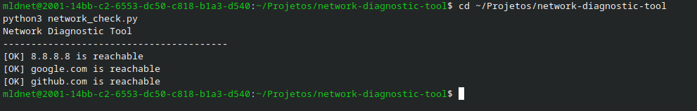

# Network Diagnostic Tool

## Network Diagnostic Demonstration

Linux-based utility focused on network diagnostics and connectivity troubleshooting.

## Overview

Network Diagnostic Tool is a lightweight command-line utility designed to assist in diagnosing connectivity issues and inspecting Linux network environments.

The project simulates troubleshooting workflows commonly used in infrastructure operations and backend support environments.

## Features

- Connectivity verification
- Host reachability testing
- DNS inspection
- Lightweight terminal diagnostics
- Infrastructure troubleshooting support

## Technologies

- Python
- Linux
- Networking utilities

## Goals

- Practice network troubleshooting workflows
- Simulate infrastructure diagnostics
- Build lightweight Linux networking tools
- Improve operational visibility

## Status

Initial development phase.

## Author

Milton Duarte  
Linux Systems Engineer  
Fedora/KDE Contributor
